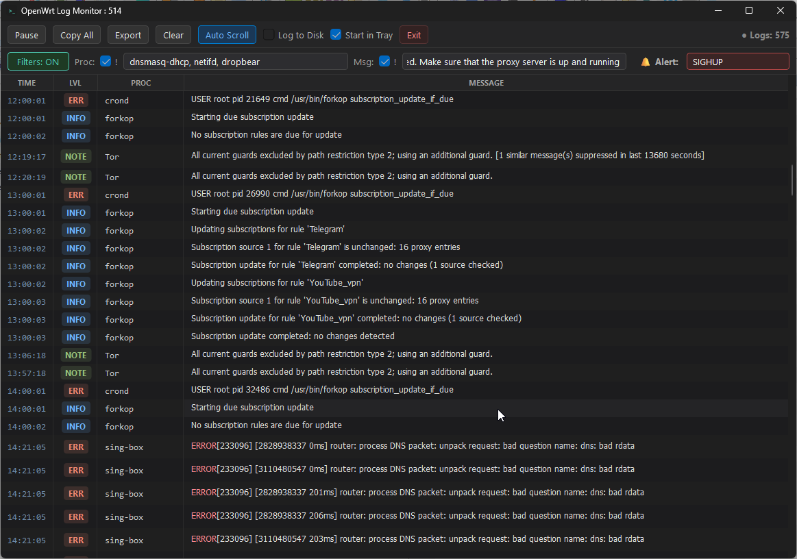

# OpenWrt Syslog Viewer

<p align="center">
  
</p>

<p align="center">
  <a href="#русский">Русский</a> •
  <a href="#english">English</a>
</p>

---

<a name="русский"></a>
## 🇷🇺 Русский

**OpenWrt Syslog Viewer** — легковесный, быстрый и удобный графический монитор системных логов (Syslog) для роутеров под управлением OpenWrt в реальном времени.

Приложение слушает входящие UDP-пакеты системного журнала на порту `514`, парсит форматы RFC 3164 / ISO 8601, подсвечивает ошибки и события, фильтрует вывод по процессам и сообщениям, поддерживает уведомления в трее Windows и запись на диск с авторотацией.

### ✨ Основные возможности

- 🚀 **Приём логов в реальном времени:** фоновый приём UDP-пакетов (порт 514) с высокой пропускной способностью и минимальной нагрузкой на CPU.
- 🎨 **Цветовые бейджи уровней важности:** наглядное выделение уровней `EMERG`, `ALERT`, `CRIT`, `ERR`, `WARN`, `NOTE`, `INFO`, `DBUG`.
- 🔍 **Умная подсветка синтаксиса:** подсветка ключевых слов (`error`, `failed`, `warning`, `timeout`), а также полная поддержка ANSI-цветов терминала.
- ⚡ **Быстрый фильтр в один клик:** кликните по названию процесса в таблице, чтобы мгновенно отфильтровать логи только по нему.
- 🛡️ **Гибкая фильтрация (включение / исключение):**
  - Фильтрация по процессам (Proc) и тексту сообщений (Msg) через запятую.
  - Чекбоксы `!` для инвертирования (исключения) указанных процессов или фраз.
  - Кнопка полного включения/отключения фильтрации (`Filters: ON/OFF`).
- 🔔 **Всплывающие уведомления (Alerts):** отслеживание ключевых слов (например, `SIGHUP`, `panic`, `attack`) с всплывающими уведомлениями в трее Windows и защитой от флуда (throttling).
- 📌 **Интеграция с Windows Tray:** сворачивание в системный трей, восстановление по клику, опция запуска сразу в трее (`Start in Tray`).
- 💾 **Логирование на диск с авторотацией:** автоматическая запись в файл `openwrt_logs.txt` с контролем размера (авторотация при достижении 100 МБ).
- 📋 **Экспорт и копирование:**
  - Кнопка **Copy All** для копирования всех видимых логов в буфер обмена.
  - Копирование выделенных строк по **Ctrl+C** или через контекстное меню.
  - Экспорт в текстовый файл с сохранением временных меток и уровней важности (`LVL`).
- 🌙 **Современный Dark UI:** эстетичный темный интерфейс в стиле VS Code с поддержкой темного заголовка окна (Windows 10/11 DWM).

---

### 📦 Установка на Windows

#### Вариант 1. Автоматическая установка (в 1 клик)
1. Скачайте или клонируйте репозиторий:
   ```cmd
   git clone https://github.com/beermix/openwrt-syslog-viewer.git
   cd openwrt-syslog-viewer
   ```
2. Запустите файл **`install.bat`**.
   * Скрипт проверит наличие Python (версии 3.8+).
   * Автоматически установит необходимые зависимости (`PyQt6`).
   * Создаст удобный ярлык **OpenWrt Syslog Viewer** на вашем Рабочем столе для запуска без консольного окна.

#### Вариант 2. Ручная установка
```cmd
pip install -r requirements.txt
pythonw "openwrt syslog viewer.pyw"
```

> **Совет:** Для быстрого запуска без окна терминала также доступен файл **`run.bat`**.

---

### ⚙️ Настройка отправки логов в OpenWrt

Чтобы роутер начал отправлять логи на ваш компьютер:

#### Способ 1. Через веб-интерфейс LuCI
1. Откройте веб-интерфейс роутера: **Система (System)** → **Система (System)** → вкладка **Журнал (Logging)**.
2. Заполните поля:
   - **IP-адрес внешнего сервера системного журнала (External system log server):** `<IP-адрес вашего компьютера>` (например, `192.168.1.100`)
   - **Порт внешнего сервера системного журнала (External system log server port):** `514`
   - **Протокол внешнего сервера системного журнала (External system log server protocol):** `UDP`
3. Нажмите **Сохранить и применить (Save & Apply)**.

#### Способ 2. Через консоль роутера (SSH)
Подключитесь к роутеру по SSH и выполните команды (замените `192.168.1.100` на IP вашего ПК):
```sh
uci set system.@system[0].log_ip='192.168.1.100'
uci set system.@system[0].log_port='514'
uci set system.@system[0].log_proto='udp'
uci commit system
/etc/init.d/log restart
```

> **Примечание по Брандмауэру Windows:**  
> При первом запуске Windows может запросить разрешение на доступ к сети. Разрешите доступ для UDP-порта 514 в вашей локальной/частной сети.

---

<a name="english"></a>
## 🇬🇧 English

**OpenWrt Syslog Viewer** is a lightweight, fast, and sleek real-time Syslog monitor designed for routers running OpenWrt.

It listens for incoming UDP packets on port `514`, parses RFC 3164 / ISO 8601 logs, highlights critical errors and warnings, provides rich multi-level filtering, triggers Windows tray alerts, and supports disk logging with automatic log rotation.

### ✨ Features

- 🚀 **Real-time Syslog Stream:** High-performance background UDP receiver on port 514 with minimal system overhead.
- 🎨 **Level Badges:** Distinct, color-coded badges for `EMERG`, `ALERT`, `CRIT`, `ERR`, `WARN`, `NOTE`, `INFO`, `DBUG`.
- 🔍 **Syntax Highlighting:** Automatic highlighting for `error`, `failed`, `warning`, `timeout` keywords and full support for ANSI terminal escape codes.
- ⚡ **One-Click Quick Filter:** Click any process name in the table to immediately isolate its logs.
- 🛡️ **Flexible Include/Exclude Filtering:**
  - Filter by process (Proc) and message body (Msg) using comma-separated keywords.
  - Checkbox `!` to invert (exclude) specified processes or phrases.
  - Master toggle switch (`Filters: ON/OFF`).
- 🔔 **Keyword Tray Alerts:** Monitor mission-critical events (e.g. `SIGHUP`, `panic`, `attack`) with Windows Tray balloon notifications and built-in flood throttling.
- 📌 **System Tray Integration:** Minimize to tray, restore on click, and optional `Start in Tray` mode.
- 💾 **Disk Logging & Rotation:** Write incoming logs to `openwrt_logs.txt` with automatic 100 MB log rotation to preserve storage.
- 📋 **Export & Clipboard:**
  - **Copy All** button to copy all visible log rows.
  - Standard **Ctrl+C** shortcut and context menu to copy selected rows.
  - Export to text file with timestamps and log levels (`LVL`).
- 🌙 **Modern Dark Theme:** Clean VS Code-inspired dark UI with native dark titlebar support on Windows 10/11.

---

### 📦 Windows Installation

#### Option 1. One-Click Auto-Installer
1. Clone or download the repository:
   ```cmd
   git clone https://github.com/beermix/openwrt-syslog-viewer.git
   cd openwrt-syslog-viewer
   ```
2. Double-click **`install.bat`**.
   * It checks for an existing Python installation (3.8+).
   * Installs required dependencies (`PyQt6`).
   * Creates a convenient **OpenWrt Syslog Viewer** desktop shortcut (running silently via `pythonw.exe`).

#### Option 2. Manual Installation
```cmd
pip install -r requirements.txt
pythonw "openwrt syslog viewer.pyw"
```

> **Tip:** You can also launch the application anytime using **`run.bat`**.

---

### ⚙️ OpenWrt Configuration

To stream syslog events from your router to your PC:

#### Via LuCI Web Interface
1. Navigate to: **System** → **System** → **Logging** tab.
2. Configure:
   - **External system log server:** `<Your PC IP Address>` (e.g. `192.168.1.100`)
   - **External system log server port:** `514`
   - **External system log server protocol:** `UDP`
3. Click **Save & Apply**.

#### Via SSH Terminal
Connect to your router via SSH and run:
```sh
uci set system.@system[0].log_ip='192.168.1.100'
uci set system.@system[0].log_port='514'
uci set system.@system[0].log_proto='udp'
uci commit system
/etc/init.d/log restart
```

---

### 📄 License

MIT License. Feel free to use, modify, and distribute.
